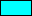
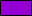
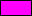
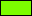
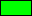
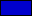
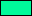

# color

A Go package for representing and working with colors in the ARGB color space.

## Installation

```sh
go get github.com/thereisnoplanb/color
```

## Overview

The `Color` type is a `uint32` value whose bits encode the four 8-bit ARGB channels:

| bits 31–24 | bits 23–16 | bits 15–8 | bits 7–0 |
|:---:|:---:|:---:|:---:|
| Alpha | Red | Green | Blue |

## Predefined colors

Over 140 named constants are provided, matching the standard .NET / CSS named-color set.

<details>
<summary>Full color table (141 colors)</summary>

| Color | Hex | Color | Hex | Color | Hex |
|:------|:----|:------|:----|:------|:----|
| Transparent ¹ | `#FFFFFFFF` |  AliceBlue | `#FFF0F8FF` |  AntiqueWhite | `#FFFAEBD7` |
|  Aqua | `#FF00FFFF` |  Aquamarine | `#FF7FFFD4` |  Azure | `#FFF0FFFF` |
|  Beige | `#FFF5F5DC` |  Bisque | `#FFFFE4C4` |  Black | `#FF000000` |
|  BlanchedAlmond | `#FFFFEBCD` |  Blue | `#FF0000FF` |  BlueViolet | `#FF8A2BE2` |
|  Brown | `#FFA52A2A` |  BurlyWood | `#FFDEB887` |  CadetBlue | `#FF5F9EA0` |
|  Chartreuse | `#FF7FFF00` |  Chocolate | `#FFD2691E` |  Coral | `#FFFF7F50` |
|  CornflowerBlue | `#FF6495ED` |  Cornsilk | `#FFFFF8DC` |  Crimson | `#FFDC143C` |
|  Cyan | `#FF00FFFF` |  DarkBlue | `#FF00008B` |  DarkCyan | `#FF008B8B` |
|  DarkGoldenrod | `#FFB8860B` |  DarkGray | `#FFA9A9A9` |  DarkGreen | `#FF006400` |
|  DarkKhaki | `#FFBDB76B` |  DarkMagenta | `#FF8B008B` |  DarkOliveGreen | `#FF556B2F` |
|  DarkOrange | `#FFFF8C00` |  DarkOrchid | `#FF9932CC` |  DarkRed | `#FF8B0000` |
|  DarkSalmon | `#FFE9967A` |  DarkSeaGreen | `#FF8FBC8F` |  DarkSlateBlue | `#FF483D8B` |
|  DarkSlateGray | `#FF2F4F4F` |  DarkTurquoise | `#FF00CED1` |  DarkViolet | `#FF9400D3` |
|  DeepPink | `#FFFF1493` |  DeepSkyBlue | `#FF00BFFF` |  DimGray | `#FF696969` |
|  DodgerBlue | `#FF1E90FF` |  Firebrick | `#FFB22222` |  FloralWhite | `#FFFFFAF0` |
|  ForestGreen | `#FF228B22` |  Fuchsia | `#FFFF00FF` |  Gainsboro | `#FFDCDCDC` |
|  GhostWhite | `#FFF8F8FF` |  Gold | `#FFFFD700` |  Goldenrod | `#FFDAA520` |
|  Gray | `#FF808080` |  Green | `#FF008000` |  GreenYellow | `#FFADFF2F` |
|  Honeydew | `#FFF0FFF0` |  HotPink | `#FFFF69B4` |  IndianRed | `#FFCD5C5C` |
|  Indigo | `#FF4B0082` |  Ivory | `#FFFFFFF0` |  Khaki | `#FFF0E68C` |
|  Lavender | `#FFE6E6FA` |  LavenderBlush | `#FFFFF0F5` |  LawnGreen | `#FF7CFC00` |
|  LemonChiffon | `#FFFFFACD` |  LightBlue | `#FFADD8E6` |  LightCoral | `#FFF08080` |
|  LightCyan | `#FFE0FFFF` |  LightGoldenrod | `#FFFAFAD2` |  LightGray | `#FFD3D3D3` |
|  LightGreen | `#FF90EE90` |  LightPink | `#FFFFB6C1` |  LightSalmon | `#FFFFA07A` |
|  LightSeaGreen | `#FF20B2AA` |  LightSkyBlue | `#FF87CEFA` |  LightSlateGray | `#FF778899` |
|  LightSteelBlue | `#FFB0C4DE` |  LightYellow | `#FFFFFFE0` |  Lime | `#FF00FF00` |
|  LimeGreen | `#FF32CD32` |  Linen | `#FFFAF0E6` |  Magenta | `#FFFF00FF` |
|  Maroon | `#FF800000` |  MediumAquamarine | `#FF66CDAA` |  MediumBlue | `#FF0000CD` |
|  MediumOrchid | `#FFBA55D3` |  MediumPurple | `#FF9370DB` |  MediumSeaGreen | `#FF3CB371` |
|  MediumSlateBlue | `#FF7B68EE` |  MediumSpringGreen | `#FF00FA9A` |  MediumTurquoise | `#FF48D1CC` |
|  MediumVioletRed | `#FFC71585` |  MidnightBlue | `#FF191970` |  MintCream | `#FFF5FFFA` |
|  MistyRose | `#FFFFE4E1` |  Moccasin | `#FFFFE4B5` |  NavajoWhite | `#FFFFDEAD` |
|  Navy | `#FF000080` |  OldLace | `#FFFDF5E6` |  Olive | `#FF808000` |
|  OliveDrab | `#FF6B8E23` |  Orange | `#FFFFA500` |  OrangeRed | `#FFFF4500` |
|  Orchid | `#FFDA70D6` |  PaleGoldenrod | `#FFEEE8AA` |  PaleGreen | `#FF98FB98` |
|  PaleTurquoise | `#FFAFEEEE` |  PaleVioletRed | `#FFDB7093` |  PapayaWhip | `#FFFFEFD5` |
|  PeachPuff | `#FFFFDAB9` |  Peru | `#FFCD853F` |  Pink | `#FFFFC0CB` |
|  Plum | `#FFDDA0DD` |  PowderBlue | `#FFB0E0E6` |  Purple | `#FF800080` |
|  Red | `#FFFF0000` |  RosyBrown | `#FFBC8F8F` |  RoyalBlue | `#FF4169E1` |
|  SaddleBrown | `#FF8B4513` |  Salmon | `#FFFA8072` |  SandyBrown | `#FFF4A460` |
|  SeaGreen | `#FF2E8B57` |  SeaShell | `#FFFFF5EE` |  Sienna | `#FFA0522D` |
|  Silver | `#FC0C0C0` |  SkyBlue | `#FF87CEEB` |  SlateBlue | `#F6A5ACD` |
|  SlateGray | `#FF708090` |  Snow | `#FFFFFAFA` |  SpringGreen | `#F00FF7F` |
|  SteelBlue | `#FF4682B4` |  Tan | `#FFD2B48C` |  Teal | `#FF008080` |
|  Thistle | `#FFD8BFD8` |  Tomato | `#FFFF6347` |  Turquoise | `#FF40E0D0` |
|  Violet | `#FFEE82EE` |  Wheat | `#FFF5DEB3` |  White | `#FFFFFFFF` |
|  WhiteSmoke | `#FFF5F5F5` |  Yellow | `#FFFFFF00` |  YellowGreen | `#FF9ACD32` |

¹ `Transparent` — RGB `#FFFFFF`, alpha = 0 (fully transparent).

</details>

```go
c := color.Crimson          // 0xFFDC143C
c  = color.DodgerBlue       // 0xFF1E90FF
c  = color.Transparent      // 0x00FFFFFF
```

## Creating colors

### From RGB / ARGB / RGBA components

```go
c := color.FromRGB(255, 0, 0)                  // fully opaque red
c  = color.FromARGB(128, 255, 0, 0)            // semi-transparent red
c  = color.FromRGBA(255, 0, 0, 128)            // same, RGBA argument order
```

### From HSL / HSLA components

```go
c, err := color.FromHSL(0, 1.0, 0.5)          // red  (hue=0°, sat=100%, light=50%)
c, err  = color.FromHSLA(120, 1.0, 0.5, 255)  // fully opaque green
```

`hue` must be in **[0, 360)**, `saturation` and `lightness` must be in **[0, 1]**.

## Reading color components

```go
c := color.CornflowerBlue

r := c.Red()        // uint8
g := c.Green()      // uint8
b := c.Blue()       // uint8
a := c.Alpha()      // uint8  (0 = transparent, 255 = opaque)

h := c.Hue()        // float64  [0, 360)
s := c.Saturation() // float64  [0, 1]
l := c.Lightness()  // float64  [0, 1]
```

## Formatting

`Format` converts a `Color` to a string in the requested layout:

| Constant | Example output |
|---|---|
| `color.INT` | `4278190335` |
| `color.HARGB` | `#FF0000FF` |
| `color.ARGB` | `FF0000FF` |
| `color.HRGB` | `#0000FF` |
| `color.RGB` | `0000FF` |
| `color.HRGBA` | `#0000FFFF` |
| `color.RGBA` | `0000FFFF` |
| `color.HSL` | `hsl(240, 100%, 50%)` |
| `color.HSLA` | `hsla(240, 100%, 50%, 1)` |
| `color.CSSRGB` | `rgb(0, 0, 255)` |
| `color.CSSRGBA` | `rgba(0, 0, 255, 1)` |
| `color.CSS4RGB` | `rgb(0 0 255)` |
| `color.CSS4RGBA` | `rgba(0 0 255 / 1)` |

```go
c := color.Blue

fmt.Println(c.Format(color.HRGB))    // #0000FF
fmt.Println(c.Format(color.HSL))     // hsl(240, 100%, 50%)
fmt.Println(c.Format(color.CSSRGBA)) // rgba(0, 0, 255, 1)
fmt.Println(c.String())              // FF0000FF  (default: AARRGGBB)
```

## Parsing

`Parse` converts a formatted string back to a `Color`:

```go
c, err := color.Parse(color.HRGB,    "#FF0000")
c, err  = color.Parse(color.HARGB,   "#FF0000FF")
c, err  = color.Parse(color.HSL,     "hsl(0, 100%, 50%)")
c, err  = color.Parse(color.CSSRGBA, "rgba(255, 0, 0, 1)")
```

## Color-space conversion helpers

```go
r, g, b        := color.HSLToRGB(0, 1.0, 0.5)   // → 255, 0, 0
h, s, l        := color.RGBToHSL(255, 0, 0)     // → 0, 1, 0.5
```

## JSON

`Color` implements `json.Marshaler` and `json.Unmarshaler`.  
Serialized format is `#RRGGBBAA`.

```go
type Widget struct {
    Background color.Color `json:"background"`
}

// {"background":"#FF0000FF"}
```

## SQL

`Color` implements `driver.Valuer` and `sql.Scanner`.  
The database value is a `#RRGGBB` hex string.

```go
var c color.Color
row.Scan(&c)           // reads "#FF0000" → color.Red
db.Exec("...", c)      // stores "#FF0000"
```

## License

See [LICENSE](LICENSE).